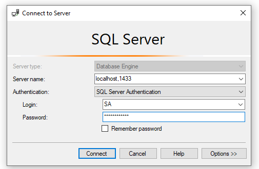

# Intro CFML

## Coldfusion Admin Panel 
p://127.0.0.1:8500/cfide/administrator/index.cfm 

## variables

variable prefix precedence 
```  
* CFC
* CFTHREAD
* Query
* Fucntion Arg
* Local var
* CGI var
* File VAR
* url PARA
* Form Fields
* CLient
```


## Conditional operators 


> Switch faster than if

## Functions/ methods 

isDefined('var') -> check if var exists     
(url.SampleVar) -> looks for 'sampleVar' in url.        
<cfparam name="varname" default="some default value> -> checks if the param exits if not assigns a default value. 
MonthaAsString(num) -> takes numeric value and changes it into string value 


## SQL server on Docker 

### Key Docker Task 
- Run SQL Server locally, but only when it is needed, 
- make it easy to upgrade

### Docker overview 
- Lingo
    - Images : An image is a read-only template with instructions for creating a Docker container. 
    - Container: container is a runnable instance of an image.
    -
- Docker’s methodologies for shipping, testing, and deploying code quickly, can significantly reduce the delay between writing code and running it in production.
- Docker’s container-based platform allows for highly portable workloads. Docker containers can run on a developer’s local laptop, on physical or virtual machines in a data center, on cloud providers, or in a mixture of environments.
- Docker Qucik Scenario 
    *   Your developers write code locally and share their work with their colleagues using Docker containers.
    *   They use Docker to push their applications into a test environment and execute automated and manual tests.
    *    When developers find bugs, they can fix them in the development environment and redeploy them to the test environment for testing and validation.
    *   When testing is complete, getting the fix to the customer is as simple as pushing the updated image to the production environment.

Install DB
`docker pull microsoft/mssql-server-windows-developer`


Set up DB
`docker run --name NjiSqlTestServer -p 1433:1433 -e 'sa_password=Pa$$word1234' -e 'ACCEPT_EULA=Y' -d microsoft/mssql-server-windows-developer`

Install SSMS and connect 

