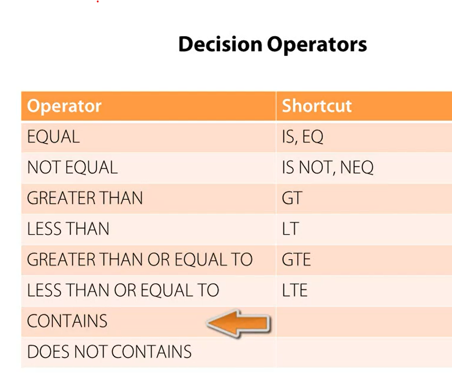

# Intro 

# Coldfusion Admin Panel 
p://127.0.0.1:8500/cfide/administrator/index.cfm 

## variables

variable prefix precedence 
```  
* CFC
* CFTHREAD
* Query
* Fucntion Arg
* Local var
* CGI var
* File VAR
* url PARA
* Form Fields
* CLient
```
#### Conditional operators 


#### Functions/ methods 

isDefined('var') -> check if var exists.  
(url.SampleVar) -> looks for 'sampleVar' in url 